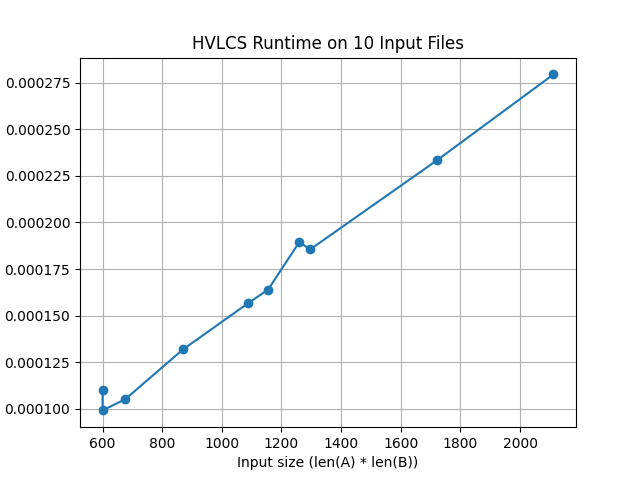

# Highest Value Longest Common Sequence

## Student Information
- Name: Antonio Diaz
- UFID: 73464639

## Repository Structure
- `src/` contains the Python source files:
  - `hvlcs.py` computes the highest value longest common subsequence for a given input file.
  - `runtime_test.py` runs the empirical runtime experiment on 10 test files and generates the runtime graph.
- `data/` contains the example input file and the 10 nontrivial test input files used for runtime testing.
- `runtime_graph.png` contains the graph for Question 1.
- `README.md` contains instructions, assumptions, and written answers for Questions 1, 2, and 3.

## Build / Compile Instructions
No compilation is required for this project because it is implemented in Python.

## How to Run

To run the program on the example input:
```bash
python src/hvlcs.py data/example.in
```

To run the program on any of the other test files:

```bash
python src/hvlcs.py data/test1.in
python src/hvlcs.py data/test2.in
python src/hvlcs.py data/test3.in
python src/hvlcs.py data/test4.in
python src/hvlcs.py data/test5.in
python src/hvlcs.py data/test6.in
python src/hvlcs.py data/test7.in
python src/hvlcs.py data/test8.in
python src/hvlcs.py data/test9.in
python src/hvlcs.py data/test10.in
```

To run the empirical runtime comparison and generate the graph for Question 1:

```bash
python src/runtime_test.py
```

If `matplotlib` is not installed, install it with:

```bash
pip install matplotlib
```

## Example Input and Output

Example input file: `data/example.in`

```text
3
a 2
b 4
c 5
aacb
caab
```

Example command:

```bash
python src/hvlcs.py data/example.in
```

Expected output:

```text
9
cb
```

## Assumptions

* The input file follows the assignment format exactly.
* The first line contains the number of characters in the alphabet.
* The next `K` lines each contain one character and its assigned integer value.
* The final two lines contain the two input strings `A` and `B`.
* Character values are nonnegative integers.
* Blank lines in the input file are ignored by the parser.
* If multiple optimal subsequences exist, the program may output any one of them.

## Question 1: Empirical Comparison

I tested the algorithm on 10 nontrivial input files, where each file contained two strings of length at least 25. For each file, I measured the runtime of the dynamic programming algorithm and plotted the runtime against the input size, where input size was measured as `len(A) * len(B)`.

Overall, the graph shows that the runtime tends to increase as the input size gets larger. Although there are small variations between some points, the overall trend is upward. This is consistent with the behavior of a dynamic programming algorithm that fills in a table of size `n * m`, where `n` is the length of string `A` and `m` is the length of string `B`.



## Question 2: Recurrence Equation

Let `dp[i][j]` represent the maximum value of a common subsequence between the suffixes `A[i:]` and `B[j:]`.

### Base Cases
If either string has been exhausted, then no more common subsequence can be formed, so:

- `dp[i][m] = 0` for all `0 <= i <= n`
- `dp[n][j] = 0` for all `0 <= j <= m`

where `n = len(A)` and `m = len(B)`.

### Recurrence
If `A[i] == B[j]`, then we have three choices:
1. skip `A[i]`
2. skip `B[j]`
3. match `A[i]` and `B[j]`, gaining the value of that character

So in that case,

`dp[i][j] = max(dp[i+1][j], dp[i][j+1], value(A[i]) + dp[i+1][j+1])`

If `A[i] != B[j]`, then we cannot match them, so we must skip one character:

`dp[i][j] = max(dp[i+1][j], dp[i][j+1])`

This recurrence is correct because at each position `(i, j)`, the best answer has to come from one of the possible choices at that point. If the characters are different, then at least one of them must be skipped. If the characters are the same, then an optimal solution may either skip one of them or match them and add that character’s value. Since the recurrence checks all valid possibilities and chooses the maximum, it correctly computes the highest-value common subsequence.

## Question 3: Pseudocode and Big-Oh

### Pseudocode

```text
HVLCS(A, B, values):
    n = length(A)
    m = length(B)

    create a table dp of size (n+1) x (m+1)
    fill every entry with 0

    for i from n-1 down to 0:
        for j from m-1 down to 0:
            dp[i][j] = max(dp[i+1][j], dp[i][j+1])

            if A[i] == B[j]:
                dp[i][j] = max(dp[i][j], values[A[i]] + dp[i+1][j+1])

    return dp[0][0]
```

### Runtime
The runtime of this algorithm is `O(nm)` because there are `n * m` subproblems, and each table entry is computed in constant time.

### Space Complexity
The space complexity is also `O(nm)` because the algorithm stores a dynamic programming table with `(n+1) * (m+1)` entries.